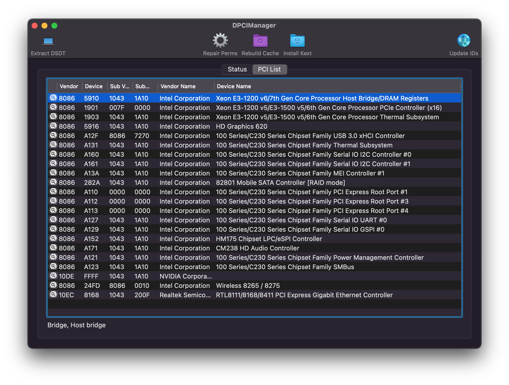

# Asus Vivobook Pro N580VD

## Computer Specifications:

| Component        | Brank                                         |
| ---------------- | --------------------------------------------- |
| CPU              | Intel® i7 7700HQ (KL)                         |
| IGPU             | Intel® HD Graphics 630                        |
| dGPU             | Nvidia 1050 GTX (disabled on macOs)           |
| Display          | 4K - 3840 x 2160 (Scaled to 1080P)            |
| Audio            | Conexant Audio CX8150                         |
| Ram              | 16GB RAM DDR4 PC19200 / 2400Mhz               |
| SSD              | 1x Micron 1100 SSD 256GB + 1x Toshiba HDD 1TB |
| Touchpad         | ELAN ELAN1200 I2C Interface                   |
| Wifi             | Intel AC 8265 and Bluetooth                   |
| Ethernet         | Realtek RTL8168 Gigabit Ethernet              |
| Backlit Keyboard | Intel AC 8265 and Bluetooth                   |
| OS               | macOS Monterey 12.2.1 Build 21D62             |
| BootLoader       | OpenCore 0.7.9                                |

### BIOS Settings:

- BIOS VER: 317
- Secure Boot Control: Disabled
- CSM Support: Disabled
- DVMT Pre-Allocated: 64M

### DCPIManager:

### Performance
